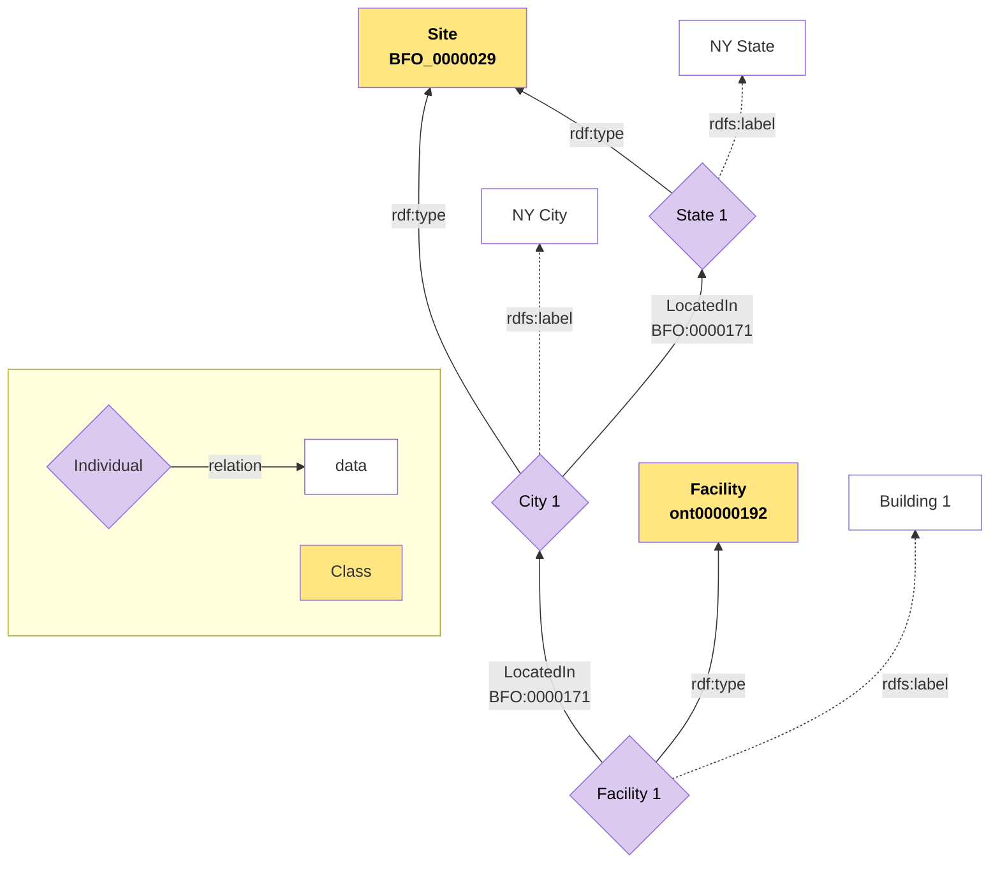

# Pattern Name
Facility Location

# Intent

To represent location relationships where material entities (e.g., facilities, equipment, infrastructure) are situated within progressively larger geographic regions or sites (e.g., building → campus → city → state → country), enabling multi-level location queries and reasoning. The specific entity types and site hierarchies shown are examples—this pattern generalizes to any material entity that can be located at sites, and any hierarchical organization of sites.

# Competency Questions

Where is a specific facility located?

what bigger site is this facility located in, and are there smaller sites that the facility is located in that are also located in the bigger site?

what are all the facilities located within a particular site?

# Structure

Represents the location of a site and there approriate relations with a broader area.

Helps with creating transitive realtions between sites. 

Visual model through mermaid and png

Additional Notes:

Geospatial Coordinate Pattern

