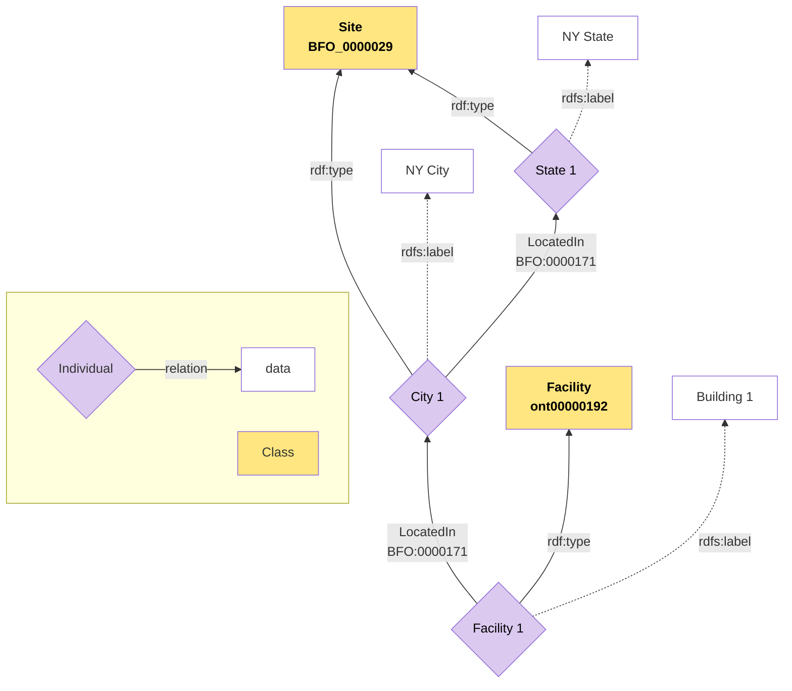

# Pattern Name
Facility Location

# Intent

To represent location relationships where material entities (e.g., facilities, equipment, infrastructure) are situated within progressively larger geographic regions or sites (e.g., building → campus → city → state → country), enabling multi-level location queries and reasoning. The specific entity types and site hierarchies shown are examples. This pattern generalizes to any material entity that can be located at sites, and any hierarchical organization of sites.

# Competency Questions

1. Where is a specific facility located?
2. What bigger site is this facility located in, and are there smaller sites that the facility is located in that are also located in the bigger site?
3. What are all the facilities located within a particular site?

# Structure

Represents the location of a site and their appropriate relations with a broader area.

Helps with creating transitive relations between sites.

Visual model through mermaid and png.

*Note: Entity types and location hierarchies shown are illustrative examples. This pattern applies to any material entities and site taxonomies relevant to your domain.*


# File Structure
```
facility-location/
├── README.md
├── mermaid/
│   ├── FacilityLocation.md        # Mermaid source file
│   └── FacilityLocation.png        # Exported PNG diagram
└── sparql/
    ├── CQ1.sparql     # Where is a specific facility located?
    ├── CQ2.sparql        # What larger/smaller sites contain this facility?
    ├── CQ3.sparql    # What facilities are within a particular site?
    └── example.ttl                  # Test data for SPARQL queries
```

## File Descriptions

### mermaid/
| File | Description |
|------|-------------|
| `FacilityLocation.md` | Mermaid diagram source showing the pattern structure |
| `FacilityLocation.png` | PNG export of the diagram for documentation |

### sparql/
| File | Competency Question |
|------|---------------------|
| `CQ1.sparql` | Where is a specific facility located? |
| `CQ2.sparql` | What bigger site is this facility located in, and are there smaller sites that the facility is located in that are also located in the bigger site? |
| `CQ3.sparql` | What are all the facilities located within a particular site? |
| `example.ttl` | Turtle file with test instances (states, cities, campuses, buildings, facilities) |

# Additional Notes

- Related pattern: Geospatial Coordinate Pattern
- Key classes: `obo:BFO_0000029` (Site), `cco:ont00000192` (Facility)
- Key property: `obo:BFO_0000171` (located in)

