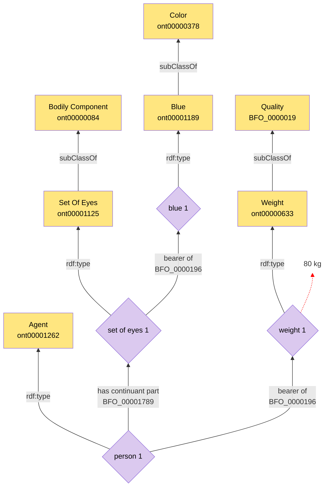

```mermaid
%%Issue with the orginal design pattern 
%%Color is no longer a Quantity and is now a Disposition.
%%TODO: Pattern to highlight disposition
%%TODO: Using disposition, create pattern for Agent eye color   

graph BT
   %% Create instances and specify type, and subClass hierarchy 

    A{person 1} --->|rdf:type| L[Agent<br>ont00001262]
   
    %%Agent Ontology CCO 
    B{set of eyes 1}--->|rdf:type| M[Set Of Eyes<br>ont00001125]
    M --->|subClassOf| N[Bodily Component<br>ont00000084]

    %%Quality Ontology CCO 
    D{blue 1}--->|rdf:type| Q[Blue<br>ont00001189]
    Q --->|subClassOf| R[Color<br>ont00000378]
    
    E{weight 1}--->|rdf:type| P[Weight<br>ont00000633] 
    P --->|subClassOf| S[Quality<br>BFO_0000019 ]
    X@{ shape: text, label: "80 kg" }

    E -.-> X
    A --->|has continuant part<br>BFO_00001789| B
    B --->|bearer of<br>BFO_0000196| D
    A --->|bearer of<br>BFO_0000196| E

%% This section specifies the formatting of the links and nodes in the mermaid diagram 
%% mermaid comment: Changing the color of a link is on order of links created, in this instance 4 refers to the link between F{weight}-.->X (the 4th one to be created) 
 
    linkStyle 7 stroke:#FF0000

    classDef yellow fill:#ffe680,color:black
    classDef purple fill:#dbc9ef,color:black
    class L,M,N,O,P,Q,R,S yellow
    class A,B,C,D,E,F purple

```