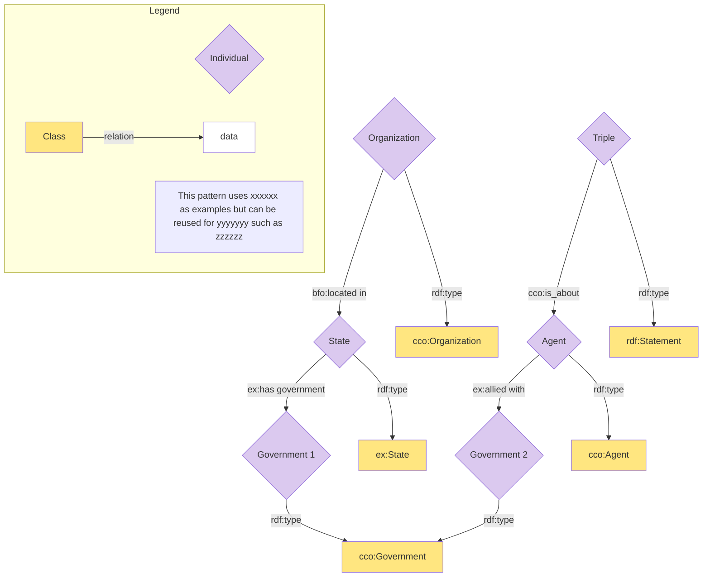

```mermaid

flowchart TB
    %% --- Legend ---
    subgraph Legend
        AA{Individual}
        BB[Class]
        CC[data]
        BB -->|relation| CC
        DD[This pattern uses xxxxxx as examples but can be reused for yyyyyyy such as zzzzzz]

        classDef yellow fill:#ffe680
        classDef purple fill:#dbc9ef
        classDef white fill:#ffffff
        class BB yellow
        class AA purple
        class CC white
    end

    %% --- Classes ---
    OrganizationClass[cco:Organization]
    StateClass[ex:State]
    GovernmentClass[cco:Government]
    AgentClass[cco:Agent]
    TripleClass[rdf:Statement]

    class OrganizationClass yellow
    class StateClass yellow
    class GovernmentClass yellow
    class AgentClass yellow
    class TripleClass yellow

    %% --- Instances ---
    Organization1{Organization}
    State1{State}
    Government1{Government 1}
    Government2{Government 2}
    Agent1{Agent}
    Triple1{Triple}

    class Organization1 purple
    class State1 purple
    class Government1 purple
    class Government2 purple
    class Agent1 purple
    class Triple1 purple

    %% --- Relations ---
    Organization1 -->|bfo:located in| State1
    State1 -->|ex:has government| Government1

    Organization1 -->|rdf:type| OrganizationClass
    State1 -->|rdf:type| StateClass
    Government1 -->|rdf:type| GovernmentClass
    Government2 -->|rdf:type| GovernmentClass

    %% --- Triple and Agent ---
    Triple1 -->|cco:is_about| Agent1
    Agent1 -->|ex:allied with| Government2

    Triple1 -->|rdf:type| TripleClass
    Agent1 -->|rdf:type| AgentClass

```
